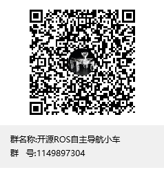
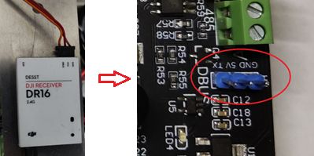

**MickRobot ** 是一个[开源小车制作项目](https://github.com/RuPingCen/mick_robot_chasiss)，教程内容包含底盘的搭建过程，基于激光雷达的导航内容。项目中小车的3D图、控制板原理图和PCB文件、控制代码均为开源。该项目具有一下特性

- 1）支持两轮差速小车、四轮差速小车、麦克纳姆轮底盘三种底盘运动学模型
- 2）支持DBUS遥控器（大疆DT7遥控器）、SBUS遥控器（RadioLink T8FB）
- 3）配套ROS节点和URDF模型

QQ交流群（开源ROS自主导航小车：**1149897304**）

**感谢**：

- 徐久铭师弟帮忙设计小车的机械图以及组装。
- 于力率、温宝愉、舒康设计测试原型控制板。
- 重庆大学机器人与智慧系统实验室（RIS）经费支持。

==注：== 本系列教程中开源的PCB文件、3D模型、相关代码，仅仅供大家自己学习自主导航小车使用，不可用于商业用途。

# Mick小车控制板

小车控制板基于STM32C8T6实现，包含有常用总线接口，同时支持5V和12V电源输出，可以满足基本需要。

- 3路串口、1路CAN接口、1路485接口（与串口3复用）
- 1路DBUS、SBUS遥控信号输入
- 3个状态指示灯，2个独立按键、4个编码开关
- 4路隔离输入、4路隔离输出

控制板原理图及PCB可从github或者加QQ群获取。 
代码地址：https://github.com/RuPingCen/mick_robot_chasiss
原理图：https://github.com/RuPingCen/mick_robot_chasiss/tree/master/Reference

Mick小车控制板实物

## 控制板连线说明

​	小车四个电机控制线通过CAN总线与控制板相连接，遥控器接收机通过控制板上的DBUS接口连接，上位机则通过232串口连接。
### 接收机连线
​	将接收机的GND、VCC、DBUS 对应连接到控制板上的蓝色排针上的GND、VCC、Tx。这里DR16接收机和普通的DBUS接收机的接线方式相同。

### 电机连线

​	电机呈U形状排列，即面向小车正前方，左上角电机ID编号为1，左下角电机ID为2，右下角电机ID为3，右上角电机ID为4。

##  控制板硬件接口及尺寸

控制板支持SBUS和DBUS两种协议的遥控器信号输入，这里主要是针对大疆的遥控器和乐迪的T8FB遥控器。

### 状态指示与按键
① **3路LED指示灯**用于显示程序状态。

​		LED1： 指示程序运行状态，正常运行为每秒20hz闪烁。

​		LED2： 指示遥控器数据 每收到一次遥控器数据闪烁LED灯状态取反一次。

​		LED3： 指示CAN总线数据 每收到一次CAN数据闪烁LED灯状态取反一次
② **2路按键**
③ **4路拨码开关**用于调试和选择程序功能。第1位和第2位用于组合选择底盘的功能模式（差速和麦克纳姆轮），第3位开关用于选择遥控器类型（SBUS或DBUS），第4位空闲

| **序号** | **第1位** | **第2位** | **第3位** | **第4位** |  **功能说明**  |
| :------: | :-------: | :-------: | :-------: | :-------: | :------------: |
|    1     |   **0**   |   **0**   |           |           |    差速底盘    |
|    2     |   **0**   |   **1**   |           |           | 麦克纳姆轮底盘 |
|    3     |   **1**   |   **0**   |           |           | 4WS4WD移动底盘 |
|    4     |   **1**   |   **1**   |           |           |       无       |
|    6     |           |           |   **0**   |           |    SBUS协议    |
|    7     |           |           |   **1**   |           |    DBUS协议    |
|    8     |           |           |           |     x     |       无       |
|    9     |           |           |           |     x     |       无       |

注：1表示开关拨到On位置

### 总线接口

​	1路DBUS接口、1路232接口、1路CAN总线、1路485接口、1路UART3接口（与485复用）、1路IIC。其中DBUS被用来接收遥航模遥控器的数据，232接口负责与上位机ROS通讯。CAN总线连接4个M3508电机。IIC连接板子上安装的MPU9250。485接口和UART3接口复用，可扩展其他传感器模块。

**注：**485接口和UART3是通过同一组串口复用实现的，默认选择了485功能，如果需要使用UART3接口，则将下图的黄色跳线帽拔下，连接右侧两个针脚即可选中UART3接口功能。

### 外部IO扩展

4路隔离输入（输入电压范围12-24V）。4路隔离输出（输出高阻态和GND，承受电流2A）。  控制板引脚功能如下

|   **名称**   |  **引脚**   |             |             |    **功能**    |
| :----------: | :---------: | :---------: | :---------: | :------------: |
|     LED      | PA6（LED1） | PA5（LED2） | C13（LED3） |    状态指示    |
|     按键     | PA7（KEY1） | PB2（KEY2） |             |                |
| 四路拨码开关 |     PB5     |     PB4     |     PB3     |      PA15      |
|   隔离输入   | PB15（IN1） | PB14（IN2） | PB13（IN3） |  PB12（IN4）   |
|   隔离输出   | PB0（OUT1） | PB1（OUT2） | PB8（OUT3） |  PB9（OUT4）   |
|    UART1     |     PA9     |    PA10     |             |    连接DBUS    |
|    UART2     |     PA2     |     PA3     |             |  与上位机通讯  |
|    UART3     |    PB10     |    PB11     |             | 复用485和UART3 |
|     IIC      |  PB6(SCL)   |  PB7(SDA)   |             |  连接MPU9250   |
|     CAN      |     A12     |     A11     |             | 连接M3508电机  |

### 供电接口

控制板输入20-36V DC直流，对外提供1路**DC 5V 2.5A** 、1路**DC 12V 2.5A** 对车载传感器供电。

### 外形尺寸

板子外形为99*99 mm 安装孔位于四周呈轴对称分布，孔中心间距为93mm,孔直径为φ3.1 mm。如下图所示。

Mick小车控制板PCB

## 大疆遥控器操作说明

​		控制板支持SBUS和DBUS两种协议的遥控器信号输入，这里主要是针对大疆的遥控器和乐迪的T8FB遥控器进行介绍。两种协议通过板子上拨码开关的第3号位置开关进行功能选择。==当第3号位置上的拨码开关拨到ON侧==则表示DBUS功能启用，否则使用SBUS（大疆遥控器）通讯协议。

###  DT7遥控器

①遥控器左上角的拨动开关为功能选择按键：置于OFF档表示不使能遥控器（此时遥控器左右摇杆无反应，遥控器无法控制小车，由上位机控制小车，即遥控器优先级高于上位机）。置于CL、CH 档表示由遥控器控制小车，忽略上位机命令。

②遥控器右上角拨动开关上中下位置分别对应小车1m/s、2m/s、3.5m/s速度

③右手边摇杆竖直方向通道控制小车前后运动（如下图所示），右边的摇杆水平通道控制小车左右旋转。

### DBUS协议

​		DBUS 这里主要是指大疆的DT7这个遥控器，接收机型号为DR16，该接收机也是最大支持16个通道。DR16接收机输出的信号为标准的DBUS协议数据,当遥控器与接收机建立连接后，接收机每隔14ms通过DBUS发送一帧1**8字节数**据。也可以接入电脑获取键盘鼠标控制信息，这个可以查阅robomaster比赛的相关资料。

如下图所示，DR16输出的前 6个字节（11*4+4）包含了遥控器上摇杆的数据，后续有10个字节（16 *5）描述键盘的相关信息，保留位有两个字节，共计18个字节。

在解析该信号时候也需要通过一个非门电路对DBUS信号取反，波特率同样为100Kbps。

### DR16接收机数据范围

DR16接收机输出数据如下：

1. 右手横向方向对应通道1，右手竖直方向对应通道2，左手竖直方向对应通道4  横向方向对应通道3。
2. 通道1至4摇杆，中间是1024 ， 水平方向向左最小（364），水平向右最大（1684）竖直方向向下最小。
3. 左侧SW1的按键值为off-1 CL-3 CH-2，左侧SW2按键值为 GPS-1 ATTI中间-3  ATTI最下-2。

## 乐迪遥控器使用说明

### T8FB遥控器

考虑到大疆遥控器价格昂贵（遥控器+接收=600+），因此新增加了对DBUS遥控器的支持，并且保持与大疆遥控器相同的操作方式。==将第3号位置上的拨码开关拨到数字侧==，表示SBUS功能。这里我用的时左手油门的RadioLink T8FB遥控器。

1. 遥控器左上角的拨动开关为功能选择按键：置于L档，即最上方位置，表示不使能遥控器。置于H档表示由遥控器控制小车，忽略上位机命令。
2. 遥控器右上角拨动开关上中下位置分别对应小车1m/s、2m/s、3.5m/s速度。
3. 右手边摇杆竖直方向通道控制小车前后运动（如下图所示），右边的摇杆水平通道控制小车左右旋转。

**注：**在拿到遥控器的时候要注意将第1通道（右手摇杆竖直方向通道）反向，保证摇杆拉到最下方的时候遥控器输出最小值，最上方输出最大值。同时，对于水平方向通道而言，拉到最左边输出最小值，最右方向输出最大值。（可以使用乐迪官方的参数配置软件进行配置“T8S-T8FB电脑调参APP V4.2”，下图是我修改后的状态。）

 

### SBUS协议

SBUS全称serial-bus，同样是一种串口通信协议，Futaba的遥控器使用较多。SBUS的数据帧格式总共25个字节，包含16个通道的数据。一个起始位字节，16个通道中每个通道占用11bit位，因此11*16=8*22，16个通道占用22个字节，**第24**个字节为状态位，第25个字节为结束位0x00。

与DBUS信号一致，SBUS也是反向逻辑，使用时候需要通过一个反相器，并将串口配置为100k波特率，8位数据位，2位停止位，偶校验（EVEN)，无控流。协议格式：（8字节）
​       [startbyte] [data1][data2]…[data22][flags] [endbyte]
​       startbyte=0x0f;
​       endbyte=0x00;
​       data1…data22: LSB（低位在前），对应16个通道（ch1-ch16），每个通道11bit（22 × 8=16 × 11)；

其中，flag位标志遥控器的通讯状态，我使用的乐迪AT9S在遥控器通上的时候是0x00，断开的时候是0xC0，可以通过查询flag位来采取失控保护。

###  T8FB数据范围

RadioLink遥控器(左手油门)输出数据如下：
1. 右手横向方向对应通道1，右手竖直方向对应通道2， 左手竖直方向对应通道3，横向方向对应通道4。
2. 通道1、3 摇杆，最下侧对应1800 最上侧对应200 中间值1000
3. 通道2、4 摇杆，左侧200 最右侧1800 中间值1000
4. 通道5 L对应200（最上侧） 中间为1000 最下为1800
5. 通道6 L对应200（ 中间为1000 最下为1800
6. 通道7 L对应200  H位置对应1800
7. 通道8  L位置对应200 H位置对应1800

**注：不同遥控器的中间值可能不同，**且通道的最大值也不一定总在左侧和上方。如天地飞遥控器 WFT09-II(左手油门)。其右手横向方向对应通道1，竖直方向对应通道2，左手竖直方向对应通道3，横向方向对应通道4。通道1-4 的范围是200-1820左右，中间值是1020，摇杆拨到最下方或者最右对应通道最小。

## 代码使用说明

控制代码基于STM32F103C8T6实现，代码位于github厂库中。控制板硬件经历过两次迭代，[代码逻辑可以参考之前的博客（开源自主导航小车MickX4（二）ROS底盘运动控制）](https://rupingcen.blog.csdn.net/article/details/108475154)

## ROS通讯节点

配套ROS节点位于这个地址：https://github.com/RuPingCen/mick_robot/tree/master/mick_bringup

与ROS节点的通讯协议为：https://docs.qq.com/sheet/DV2hmSEdSYVVtclB4?u=05ce7c972c744a87877202d1e7c37914&tab=bb08j2

# 小车电源板

在自主导航小车上我们通常需要对工控机供电（19V 3A）、激光雷达（12V 1A）、网桥、4G路由器等（12V），以及其他的一些辅助传感器供电。因此我们设计了一款输入20-36V直流输入，输出5V、12V、19V、3.3-19V可调4路直流电压的电源板，如下图所示。可满足自主导航小车所需传感器的供电需求。原理图可从github上获取或者加QQ群获取。

## 输出参数

如下图所示，电源板输入20-36V DC直流，**输出1路DC 5V 2A** 、**1路DC 3.3-19V 2A 可调电源** 、**1路DC 12V 3.5A、1路DC 19V 3.5A**，可满足对工控机和自主导航小车车载传感器供电需求。

经过电子负载实际测试，5V和3.3V-19V 采用LM2596S方案,每一路可实现2A的稳定输出，加装散热片以后可实现2.5A长时间输出，如图2所示。

12V 在电子负载实测中可以达到长时间稳定输出3.5A 输出，加装扇热片以后可以实现4A长时间输出，短时可达4.5A，如图3所示。

19V在电子负载实测中可以达到长时间稳定输出3.5A 输出，加装扇热片以后可以实现4A长时间输出，短时可达4.5A，如图4所示。

19V输出测试

​                                                                                

## 外形尺寸

板子外形为99*99 mm 安装孔位于四周呈轴对称分布，孔中心间距为93mm,孔直径为φ3.1 mm。如图6所示。

 
